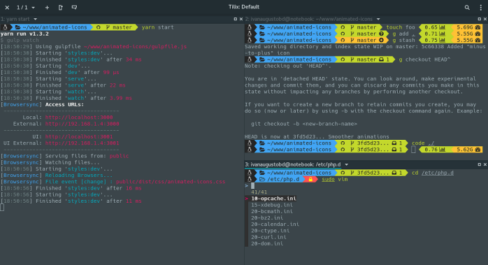

# MX Linux Developer Setup


## Table of Contents
- [Introduction](#introduction)
- [Prerequisites](#prerequisites)
  - [System Requirements](#system-requirements)
  - [MX Linux](#mx-linux)
  - [sudo Setup](#sudo-setup)
  - [Essential Development Tools](#essential-development-tools)
  - [Version Control](#version-control)
- [Installation](#installation)
  - [Programming Languages and Environments](#programming-languages-and-environments)
    - [nodejs via nvm](#nodejs-via-nvm)
    - [C/C++ Development Tools](#cc-development-tools)
    - [Ruby, Node.js, and Rails via asdf](#ruby-nodejs-and-rails-via-asdf)
      - [Dependencies](#dependencies)
      - [asdf Setup](#asdf-setup)
      - [Ruby plugin and latest Ruby](#ruby-plugin-and-latest-ruby)
      - [nodejs via asdf](#nodejs-via-asdf)
      - [Rails](#rails)
  - [Development Tools](#development-tools)
    - [Code Editors](#code-editors)
    - [Docker for containerisation](#docker-for-containerisation)
    - [Postman API Client](#postman-api-client)
      - [Postman menu setup](#postman-menu-setup)
    - [Terminal Enhancements](#terminal-enhancements)
      - [TMUX](#tmux)
      - [TMUX commands](#tmux-commands)
  - [Databases](#databases)
    - [MSSQL 2022 Setup](#mssql-2022-setup)
      - [Docker Compose File](#docker-compose-file)
        - [Create the docker-compose.yaml file](#create-the-docker-composeyaml-file)
        - [Prepare the log folder](#prepare-the-log-folder)
        - [Build and start the container](#build-and-start-the-container)
        - [What is this command doing](#what-is-this-command-doing)
        - [Git Ignore (optional)](#git-ignore-optional)
        - [Confirm Docker Volume is used for data](#confirm-docker-volume-is-used-for-data)
      - [Setting up lazydocker](#setting-up-lazydocker)
      - [Wrapping up](#wrapping-up)
- [rclone](#rclone)
  - [Installation](#rclone-installation)
  - [Configuration](#configuration)
    - [Setting Up Google Drive Remote](#setting-up-google-drive-remote)
  - [Basic Usage](#basic-usage)
  - [Setting Up Automatic Mounting](#setting-up-automatic-mounting)
  - [Advanced Usage](#advanced-usage)
  - [Troubleshooting](#troubleshooting)
    - [Common Issues and Solutions](#common-issues-and-solutions)
  - [Additional Resources](#additional-resources)
  - [Conclusion](#conclusion)

## Introduction
Hello welcome to this guide where we go through the process of setting an MX Linux development environment.

By the end of this guide you will have setup:
- Development tools
- asdf + Ruby + Rails
- dotnet 9 SDK for ASP.NET/C# development
- Docker + lazydocker + an MSSQL 2022 container

This will prepare your Linux environment to work with ASP.NET Core and other development
environments that can leverage MSSQL 2022 Server.

We briefly go over setting up the latest dotnet SDK (version 9 as of the time of writing)
and a create a very simple application to test connectivity and operation of the MSSQL database
server.

## Prerequisites

### System Requirements
Here is the spec of the test laptop used for this guide:

- Samsung i5 NP370R UK spec
- 16GB DDR 1600 ram (max for this laptop)
- Samsung 870 EVO SSD 500GB
- Intel Graphics chipset

The EVO SDD drive is a big improvement makes the laptop very usable especially due to the light footprint of MX Linux.

### MX Linux


I recommend MX Linux as lightweight but powerful distro its based on Debian 12 currently and has
a lot to offer out of the box, you can download it here: https://mxlinux.org/download-links/.

MX Linux was my choice because I also wanted to revive an older laptop and experience what its like to have to battle resources and fine tune your Linux distro for best performance and I have to say I am quite impressed with this little Linux. Doesn't require too much to setup most guides for Debian and Ubuntu are relevant however MX Linux users however do note MX Linux uses `SysVinit` as its default init system, though it also includes `systemd` and allows users to choose between the two using the `systemd-shim` package.

Installation was fairly straightforward I chose the USB boot method and again was impressed by the performance of the Live USB version of MX Linux where you can find the MX Linux installer icon on the desktop and here the setup is painless the usual options for a typical Debian distro.

### sudo Setup
We need to ensure the sudoer file which controls which users can use the `sudo` command to execute commands with elevated privileges:
```
# User privilege specification
root    ALL=(ALL:ALL) ALL
your_username_here  ALL=(ALL:ALL) ALL
```
You will only see the root line, copy this line to next one and then change the root user to whatever your
logged in username is. These lines are telling the system those users run any command as any user on any host i.e. giving them admin privileges.

### Essential Development Tools
First make sure the system is up to date:
```
sudo apt update && sudo apt upgrade && sudo apt dist-upgrade
```
This will ensure everything is up to date and you have the latest distro.

Next we need the basic development tools:
```
sudo apt install build-essential git curl wget
```

### Version Control
Git is essential for any development work:
```
sudo apt install git
git config --global user.name "Your Name"
git config --global user.email "your.email@example.com"
```
Where `Your Name` is your git username and `your.email@example.com` is the email address registered to your git account.

## Installation

### Programming Languages and Environments
Depending on your development needs, you might want to install a few components I like to have the nodejs, python, Ruby (and Rails using asdf, see below for steps).

#### nodejs via nvm


I prefer to use nvm for version management:
```
curl -o- https://raw.githubusercontent.com/nvm-sh/nvm/v0.39.3/install.sh | bash
```
The install script will run and display the following:
```
$ curl -o- https://raw.githubusercontent.com/nvm-sh/nvm/v0.39.3/install.sh | bash
  % Total    % Received % Xferd  Average Speed   Time    Time     Time  Current
                                 Dload  Upload   Total   Spent    Left  Speed
100 15916  100 15916    0     0    98k      0 --:--:-- --:--:-- --:--:--   98k
=> Downloading nvm from git to '/home/trevor/.config/nvm'
=> Cloning into '/home/trevor/.config/nvm'...
remote: Enumerating objects: 382, done.
remote: Counting objects: 100% (382/382), done.
remote: Compressing objects: 100% (325/325), done.
remote: Total 382 (delta 43), reused 178 (delta 29), pack-reused 0 (from 0)
Receiving objects: 100% (382/382), 386.80 KiB | 4.03 MiB/s, done.
Resolving deltas: 100% (43/43), done.
* (HEAD detached at FETCH_HEAD)
  master
=> Compressing and cleaning up git repository

=> Appending nvm source string to /home/trevor/.bashrc
=> Appending bash_completion source string to /home/trevor/.bashrc
=> You currently have modules installed globally with `npm`. These will no
=> longer be linked to the active version of Node when you install a new node
=> with `nvm`; and they may (depending on how you construct your `$PATH`)
=> override the binaries of modules installed with `nvm`:

/home/trevor/.asdf/installs/nodejs/18.19.0/lib
├── corepack@0.22.0
└── yarn@1.22.22
=> If you wish to uninstall them at a later point (or re-install them under your
=> `nvm` Nodes), you can remove them from the system Node as follows:

     $ nvm use system
     $ npm uninstall -g a_module

=> Close and reopen your terminal to start using nvm or run the following to use it now:

export NVM_DIR="$HOME/.config/nvm"
[ -s "$NVM_DIR/nvm.sh" ] && \. "$NVM_DIR/nvm.sh"  # This loads nvm
[ -s "$NVM_DIR/bash_completion" ] && \. "$NVM_DIR/bash_completion"  # This loads nvm bash_completion
```
The export command is useful if you don't want to have to restart your terminal session:
```
export NVM_DIR="$HOME/.config/nvm"
[ -s "$NVM_DIR/nvm.sh" ] && \. "$NVM_DIR/nvm.sh"  # This loads nvm
[ -s "$NVM_DIR/bash_completion" ] && \. "$NVM_DIR/bash_completion"  # This loads nvm bash_completion
```
Finally run `exec $SHELL -l` to reload the (login) shell.

#### C/C++ Development Tools
```
sudo apt install gcc g++ cmake gdb
```

#### Ruby, Node.js, and Rails via asdf

##### Dependencies
```
sudo apt update
sudo apt install -y build-essential autoconf bison libssl-dev libyaml-dev libreadline-dev zlib1g-dev libncurses-dev libffi-dev libgdbm-dev curl git
```

##### asdf Setup
Clone asdf into your home directory:
```
git clone https://github.com/asdf-vm/asdf.git ~/.asdf --branch v0.13.1
```

Add asdf to the shell (bash or zsh):
```
# For bash

echo '. "$HOME/.asdf/asdf.sh"' >> ~/.bashrc
echo '. "$HOME/.asdf/completions/asdf.bash"' >> ~/.bashrc
source ~/.bashrc
```

```
# For zsh

echo '. "$HOME/.asdf/asdf.sh"' >> ~/.zshrc
echo '. "$HOME/.asdf/completions/asdf.bash"' >> ~/.zshrc
source ~/.zshrc
```

##### Ruby plugin and latest Ruby

```
asdf plugin add ruby
asdf list all ruby
asdf install ruby latest
asdf global ruby latest
```
This can take a few minutes depending on your hardware specifications. Once complete you
can test Ruby with the following command:
```
ruby -v
```
This should display the latest version number of Ruby that is installed (3.4.2 at the time of writing).

##### nodejs via asdf
```
asdf plugin add nodejs
asdf install nodejs latest
asdf global nodejs latest
```

##### Rails


Install the latest Rails
```
gem install rails
```
You may be prompted to upgrade RubyGems you can do this now if needed:
```
gem update --system 3.6.7
```
Verify the installation:
```
ruby -v
node -v
rails -v
```

### Development Tools

#### Code Editors


I like to edit code both in the terminal and using VS Code.
```
# install micro editor
sudo apt install micro
```

```
# VS Code (via .deb package)
wget -O vscode.deb "https://code.visualstudio.com/sha/download?build=stable&os=linux-deb-x64"
sudo apt install ./vscode.deb
```

#### Docker for containerisation

```
sudo apt install apt-transport-https ca-certificates gnupg lsb-release
curl -fsSL https://download.docker.com/linux/debian/gpg | sudo gpg --dearmor -o /usr/share/keyrings/docker-archive-keyring.gpg
echo "deb [arch=amd64 signed-by=/usr/share/keyrings/docker-archive-keyring.gpg] https://download.docker.com/linux/debian $(lsb_release -cs) stable" | sudo tee /etc/apt/sources.list.d/docker.list > /dev/null

# update apt
sudo apt update

# install docker components
sudo apt install docker-ce docker-ce-cli containerd.io

# add your user to docker group
sudo usermod -aG docker $USER
```

#### Postman API Client


Postman is a handy API testing tool and quite easy to setup:
```
# download Postman tarball
cd ~/Downloads
wget https://dl.pstmn.io/download/latest/linux64 -O postman.tar.gz

# extract the archive into the /opt folder
sudo tar -xzf postman.tar.gz -C /opt

# create a symlink
sudo ln -s /opt/Postman/Postman /usr/bin/postman
```

##### Postman menu setup


MX Linux menu is quite configurable and you can add Postman to the Development tab with the following steps:

- Right click the MX Linux start button and select `Edit Applications` option.
- From the MenuLibre dialog expand the Development category and select the `Development` tab
- Press the + icon at the top left to create a new entry
- Left-click on the icon to select the Postman icon located in `/opt/Postman/Postman`
- Left-click New Launcher name to rename to `Postman`
- Left-click the Description and change to `Make and view REST API calls and responses`
- Set the Command to `/opt/Postman/Postman`
- Left-click the disk icon to save (next to the + button)

You should now see the Postman icon displayed under the Development category. Close the MenuLibre window and then left click the MX Linux launcher button navigate to Development and click on the Postman icon to launch Postman (you will be prompted to sign-in or register).

#### Terminal Enhancements


I like having split windows in a terminal and first came across this feature when I was testing out the awesome [Omakub](https://omakub.org/) for Ubuntu created by the awesome [DHH](https://dhh.dk/). Thankfully we have TMUX a terminal multiplexer that lets you manage your terminal split it into panes and do other wonderful.

##### TMUX
1. Update the packages list
```
sudo apt update
```
2. Install TMUX
```
sudo apt install tmux
```
3. Verify installation
```
tmux -V
```

##### TMUX commands
Below is a list of some common useful commands for `tmux` (organised by category, for more commands and details checkout the **cheatography.com** [cheat sheet](https://cheatography.com/alexandreceolin/cheat-sheets/tmux-terminal-multiplexer/)):

_**Note:** the prefix key default is `ctrl+b`_ 

1. Session Management
- `tmux` - Start a new session
- `tmux new -s sessionname` - Start a new named session
- `tmux ls` - List all sessions
- `tmux attach` or `tmux a` - Attach to the last session
- `tmux attach -t sessionname` - Attach to a specific session
- `tmux kill-session -t sessionname` - Kill a specific session
- `tmux kill-server` - Kill all sessions

2. Pane Management
- `Prefix + "` - Split pane horizontally
- `Prefix + %` - Split pane vertically
- `Prefix + arrow key` - Navigate between panes
- `Prefix + o` - Cycle through panes
- `Prefix + z` - Toggle pane zoom (maximize/restore a pane)
- `Prefix + x` - Kill current pane
- `Prefix + {` - Move current pane left
- `Prefix + }` - Move current pane right
- `Prefix + Ctrl+arrow` - Resize pane in arrow direction
- `Prefix + q` - Show pane numbers (press a number to quickly jump to that pane)

3. Window (Tab) Management
- `Prefix + c` - Create new window
- `Prefix + n` - Move to next window
- `Prefix + p` - Move to previous window
- `Prefix + number` - Switch to window by number
- `Prefix + w` - List windows (interactive selection)
- `Prefix + ,` - Rename current window
- `Prefix + &` - Kill current window

4. Copy Mode
- `Prefix + [` - Enter copy mode (use vi or emacs keys to navigate)
- `Space` - Start selection (in copy mode)
- `Enter` - Copy selection (in copy mode)
- `Prefix + ]` - Paste copied text

5. Other useful commands
- `Prefix + d` - Detach from session
- `Prefix + :` - Enter command mode
- `Prefix + ?` - List all key bindings
- `Prefix + t` - Show clock

### Databases


I didn't bother with a local database server as per this guide, any DB will be hosted in a docker container of my choice whether its postgres or MSSQL or something else. It is worth having `sqlite3` installed locally for lightweight storage handing when you're scripting or writing some apps like Ruby for automation (or just fun).
```
# SQLite
sudo apt install sqlite3
```

#### MSSQL 2022 Setup


This section covers setting up the MSSQL 2022 docker image container and configuring to work with MX Linux
and for development tasks.

##### Docker Compose File
This example creates a docker-compose file that spins up an MSSQL 2022 Server container with the data folder as a volume and logs as a bind mount.

###### Create the docker-compose.yaml file
Lets use micro to create the file in the test folder (I created a new folder called `mssql-2022` under `/home/trevor/Development/Docker`):
```
micro docker-compose.yaml
```
This will open a new blank document, press `Ctrl + s` keys once to save this new document and then copy and paste (`Ctrl + v`) the contents into the micro editor in your terminal window:
```
services:
  mssql:
    image: mcr.microsoft.com/mssql/server:2022-latest
    container_name: mssql-dev
    environment:
      - ACCEPT_EULA=Y
      - MSSQL_PID=Developer
      - MSSQL_SA_PASSWORD=Passw0rd1_99!
    ports:
      - "1433:1433"
    volumes:
      - mssql-data:/var/opt/mssql
      - ./mssql-logs:/var/opt/mssql/log
    restart: unless-stopped
    shm_size: 2gb
    networks:
      - crudapp-network

networks:
  crudapp-network:
    driver: bridge

volumes:
  mssql-data:
```
Press `Ctrl + s` once again to save and then press `Ctrl + q` to quit the editor.

###### Prepare the log folder
Now create the log folder and set the permissions for the `mssql` user:
```
mkdir -p ./mssql-logs
```

You can find the UID with the following command:
```
docker exec -it mssql-dev id mssql
```
Which should display the UID for `mssql`
```
uid=10001(mssql) gid=10001(mssql) groups=10001(mssql)
```

Finally set the permission to avoid issues when SQL server tries to write the logs to this location:
```
sudo chown -R 10001:0 ./mssql-logs
```

###### Build and start the container
The following command will start everything clean, destroying an old containers and volumes and rebuilds using the docker-compose file:
```
docker compose down -v
docker compose up -d --force-recreate
```
The `-d` switch starts the container in the background.

To inspect the container logs we can use the following command:
```
tail -f ./mssql-logs/errorlog
```

###### What is this command doing
This command is monitoring the SQL Server error log file in real-time.

The tail command is a Unix/Linux utility that displays the last part of a file. By default, it shows the last 10 lines of a file.

The `-f` flag (which stands for "follow") is what makes this particularly useful. It causes tail to continuously monitor the file and display new lines as they're added to the file. This creates a real-time stream of the log content as it's being written.

`./mssql-logs/errorlog` is the relative path to Microsoft SQL Server's error log file. The `./` indicates that the `mssql-logs` directory is located in the current working directory.

###### Git Ignore (optional)
If you are adding your `docker-compose.yaml` file to your project folder that is using github then you need to exclude the logs folder (if its located in the same location, best practice would be to locate this folder somewhere else like `/var/log`, if you do this remember to set the appropriate permission as detailed previously):
```
echo "mssql-logs/" >> .gitignore
```

This command adds a directory to the `.gitignore` file, which tells Git to ignore certain files and directories when tracking changes in your project.

###### Confirm Docker Volume is used for data
The following command should show a mount point:
```
docker volume inspect mssql-data
```
In this example the output is in JSON when the above command executed:
```
[
    {
        "CreatedAt": "2025-04-11T12:18:18+01:00",
        "Driver": "local",
        "Labels": null,
        "Mountpoint": "/var/lib/docker/volumes/mssql-data/_data",
        "Name": "mssql-data",
        "Options": null,
        "Scope": "local"
    }
]
```

### lazydocker


[lazydocker](https://github.com/jesseduffield/lazydocker?tab=readme-ov-file) is a great app for managing Docker containers and its fairly easy to setup with various [methods](https://github.com/jesseduffield/lazydocker#installation).

I have detailed two methods below either one will get `lazydocker` setup ready for use.

#### Install using the installation script

This is the easiest method:

```bash
curl https://raw.githubusercontent.com/jesseduffield/lazydocker/master/scripts/install_update_linux.sh | bash
```

#### Download a binary release

1. Visit the releases page: https://github.com/jesseduffield/lazydocker/releases
2. Download the Linux tarball for your architecture (likely `lazydocker_0.20.0_Linux_x86_64.tar.gz` or similar)
3. Extract it:
   ```bash
   tar -xzf lazydocker_0.20.0_Linux_x86_64.tar.gz
   ```
4. Move the binary to a directory in your PATH:
   ```bash
   sudo mv lazydocker /usr/local/bin/
   ```

Once installed you can simply run it by typing `lazydocker` in a terminal to launch the terminal GUI.


## rclone
**Rclone** is a powerful, command-line tool for managing files on a wide variety of cloud storage services. Often called *"The Swiss army knife of cloud storage"*, it supports over 70 backends—from Google Drive and Dropbox to S3-compatible services and standard transfer protocols like FTP and WebDAV.

Designed as a robust alternative to vendor-specific web interfaces, Rclone offers a familiar experience for Linux users, with commands that mirror common UNIX utilities such as `cp`, `mv`, `ls`, `cat`, and even `mount`. Whether you're scripting automated backups or manually syncing files, Rclone's `--dry-run` and pipeline-friendly syntax make it both safe and efficient.

### Installation {#rclone-installation}
Open a terminal and run the following commands:

```bash
# Install rclone from the Debian repositories
sudo apt update
sudo apt install rclone

# Verify installation
rclone version
```

### Configuration

#### Setting Up Google Drive Remote

1. Start the configuration process:
   ```bash
   rclone config
   ```

2. Follow the interactive setup:
   ```
   n) New remote
   name> gdrive    # Enter a name for your remote (use whatever name you prefer)

   # Select Google Drive from the list of storage types
   Storage> drive

   client_id>      # Press Enter to use default
   client_secret>  # Press Enter to use default

   scope> 1        # Usually select option 1 for full access

   root_folder_id> # Press Enter for default (root of your Drive)

   service_account_file> # Press Enter unless you have one

   y) Yes this is OK
   ```

3. Complete authentication:
   - Rclone will provide a URL
   - Open the URL in your web browser
   - Log in to your Google account and grant permission
   - Copy the verification code back to the terminal

4. Verify setup:
   ```bash
   rclone lsd gdrive:
   ```
   This will list directories in your Google Drive.

### Basic Usage

1. Listing Files and Directories

```bash
# List directories
rclone lsd gdrive:

# List all files and directories
rclone ls gdrive:

# List files with details (size, date, path)
rclone lsf gdrive: --format=ps

# Search for specific files
rclone lsf gdrive: --include "*.pdf"
```

2. Mounting Google Drive

```bash
# Create a mount point
mkdir ~/google-drive

# Mount your Google Drive
rclone mount gdrive: ~/google-drive --daemon

# To unmount
fusermount -u ~/google-drive
```

3. Transferring Files

```bash
# Copy a file from local to Google Drive
rclone copy /path/to/local/file.txt gdrive:destination/folder/

# Copy a file from Google Drive to local
rclone copy gdrive:path/to/file.txt ~/local-destination/

# Copy a directory and all contents
rclone copy gdrive:path/to/directory ~/local-destination/ -P

# Sync folders (make destination identical to source)
rclone sync ~/local-directory gdrive:remote-directory -P
```

4. Copying Large Files with Progress Display

For large file transfers, use the progress flag to monitor the operation:

```bash
# Copy with progress display
rclone copy gdrive:path/to/large/file.ext ~/local-destination/ -P

# Copy with progress and increased transfer parallelism
rclone copy gdrive:path/to/folder ~/local-destination/ -P --transfers=4 --checkers=8
```

The `-P` flag shows:
- Transfer speed
- ETA (estimated time of arrival)
- Percentage completed
- Amount transferred

For large transfers that might take hours:

```bash
# Run in background and log progress
nohup rclone copy gdrive:path/to/folder ~/local-destination/ -P --stats-one-line > rclone_log.txt &

# Check the log file
tail -f rclone_log.txt
```

### Setting Up Automatic Mounting

To have your Google Drive automatically mount at system startup:

1. Create a systemd service file:
   ```bash
   sudo nano /etc/systemd/system/rclone-gdrive.service
   ```

2. Add these contents (adjust paths and username):
   ```
   [Unit]
   Description=Google Drive Mount with Rclone
   After=network-online.target
   Wants=network-online.target

   [Service]
   Type=simple
   User=YOUR_USERNAME
   ExecStart=/usr/bin/rclone mount gdrive: /home/YOUR_USERNAME/google-drive --vfs-cache-mode=writes
   ExecStop=/bin/fusermount -u /home/YOUR_USERNAME/google-drive
   Restart=on-failure
   RestartSec=30

   [Install]
   WantedBy=multi-user.target
   ```

3. Enable and start the service:
   ```bash
   sudo systemctl enable rclone-gdrive.service
   sudo systemctl start rclone-gdrive.service
   ```

4. Check service status:
   ```bash
   sudo systemctl status rclone-gdrive.service
   ```

### Advanced Usage

1. Check Space Usage

```bash
rclone about gdrive:
```

2. Working with Shared Drives (Team Drives)

```bash
# List available team drives
rclone lsd gdrive:

# Access files in a team drive
rclone ls "gdrive:Team Drive Name"
```

3. Bandwidth Control

```bash
# Limit bandwidth to 1MB/s
rclone copy gdrive:file.mp4 ~/ --bwlimit 1M -P
```

4. Use with Cron for Scheduled Backups

Example crontab entry for daily backup at 2 AM:
```
0 2 * * * /usr/bin/rclone sync /home/user/documents gdrive:backup/documents --log-file=/home/user/logs/backup.log
```

### Troubleshooting

#### Common Issues and Solutions

1. **Authentication failed**: Re-run `rclone config` and set up the remote again.

2. **Mount not responding**: Unmount and remount:
   ```bash
   fusermount -u ~/google-drive
   rclone mount gdrive: ~/google-drive --daemon
   ```

3. **Files not appearing**: Refresh the virtual filesystem:
   ```bash
   rclone rc vfs/refresh recursive=true
   ```

4. **Connection problems**: Try reconnecting:
   ```bash
   rclone config reconnect gdrive:
   ```

5. **Slow transfers**: Increase parallelism and adjust chunk size:
   ```bash
   rclone copy gdrive:folder local/ -P --transfers=8 --checkers=16 --drive-chunk-size=32M
   ```

### Additional Resources

- [Official Rclone Documentation](https://rclone.org/docs/)
- [Rclone Google Drive Specific Documentation](https://rclone.org/drive/)
- [Rclone GitHub Repository](https://github.com/rclone/rclone)

### Conclusion

Rclone provides a powerful, flexible solution for connecting MX Linux to Google Drive. With its command-line interface, it offers efficient file management capabilities, from simple transfers to complex synchronization tasks. Whether you need to download individual files or maintain synchronized backups, rclone provides the tools needed to effectively manage your Google Drive contents from your Debian-based system.