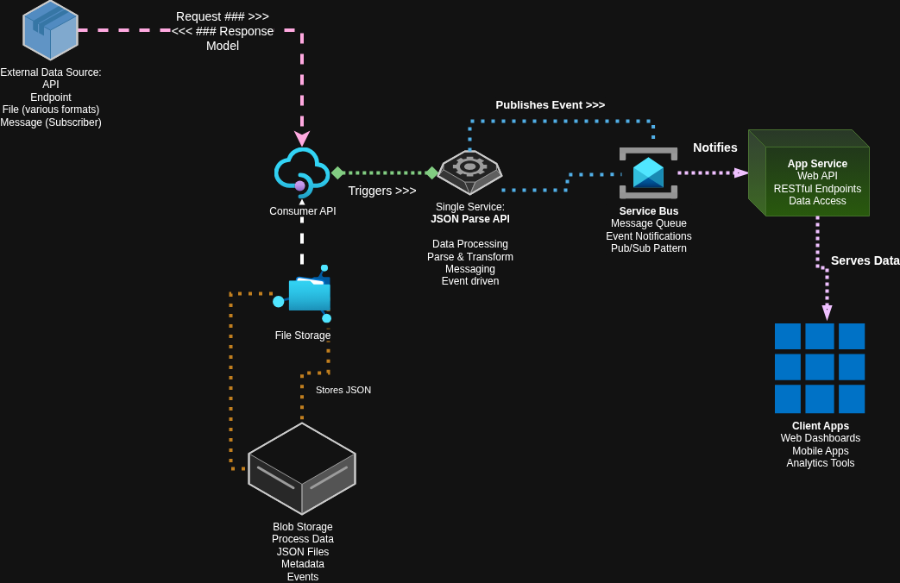

# CSV to JSON Processing Architecture



## Overview

This document describes a cloud-based data processing solution built with .NET 9 that transforms CSV files into JSON format and makes the processed data available through multiple consumption channels. The architecture follows an event-driven pattern with microservices handling different aspects of the data pipeline.

## Architecture Components

### Core Processing Flow

1. **Data Ingestion**
   - External data sources provide CSV files through various channels (API endpoints, file uploads, scheduled imports)
   - Files are received and queued for processing

2. **JSON Parsing Service**
   - Processes incoming CSV files and transforms them into structured JSON
   - Handles data validation, transformation, and normalization
   - Publishes events when processing is complete

3. **Storage Layer**
   - **File Storage**: Stores processed JSON files as blobs for direct file access
   - **Blob Storage**: Maintains metadata, events, and processed data files

4. **Service Bus Integration**
   - Implements publish/subscribe messaging pattern
   - Handles event notifications between services
   - Manages message queuing for reliable processing

5. **API Gateway**
   - Provides RESTful endpoints for data access
   - Handles authentication and rate limiting
   - Routes requests to appropriate services

6. **Client Applications**
   - Web dashboards for data visualization
   - Mobile applications for on-the-go access
   - Analytics tools for business intelligence

## Key Features

- **Event-Driven Architecture**: Loose coupling between components enables scalability and maintainability
- **Multiple Data Access Methods**: Data available via both file downloads and API endpoints
- **Real-time Notifications**: Service bus ensures immediate notification of data processing completion
- **Scalable Processing**: Independent services can scale based on demand
- **Cross-Platform Compatibility**: .NET 9 enables deployment across various environments

## Example Implementation (C# .NET 9)

### CSV Processing Service

```csharp
using System.Text.Json;
using Microsoft.Extensions.Hosting;
using Microsoft.Extensions.Logging;

public class CsvProcessingService : BackgroundService
{
    private readonly ILogger<CsvProcessingService> _logger;
    private readonly IBlobStorageService _blobStorage;
    private readonly IServiceBusPublisher _serviceBus;

    public CsvProcessingService(
        ILogger<CsvProcessingService> logger,
        IBlobStorageService blobStorage,
        IServiceBusPublisher serviceBus)
    {
        _logger = logger;
        _blobStorage = blobStorage;
        _serviceBus = serviceBus;
    }

    protected override async Task ExecuteAsync(CancellationToken stoppingToken)
    {
        await foreach (var csvFile in GetIncomingFiles(stoppingToken))
        {
            try
            {
                var jsonData = await ProcessCsvToJson(csvFile);
                await StoreProcessedData(jsonData, csvFile.Id);
                await NotifyProcessingComplete(csvFile.Id);
            }
            catch (Exception ex)
            {
                _logger.LogError(ex, "Error processing file {FileId}", csvFile.Id);
            }
        }
    }

    private async Task<JsonDocument> ProcessCsvToJson(CsvFile csvFile)
    {
        using var reader = new StringReader(csvFile.Content);
        var records = new List<Dictionary<string, object>>();

        // Parse CSV headers
        var headers = (await reader.ReadLineAsync())?.Split(',');
        
        string line;
        while ((line = await reader.ReadLineAsync()) != null)
        {
            var values = line.Split(',');
            var record = new Dictionary<string, object>();
            
            for (int i = 0; i < headers.Length && i < values.Length; i++)
            {
                record[headers[i]] = values[i];
            }
            
            records.Add(record);
        }

        return JsonDocument.Parse(JsonSerializer.Serialize(records));
    }
}
```

### API Controller for Data Access

```csharp
using Microsoft.AspNetCore.Mvc;
using System.Text.Json;

[ApiController]
[Route("api/[controller]")]
public class DataController : ControllerBase
{
    private readonly IBlobStorageService _blobStorage;
    private readonly ILogger<DataController> _logger;

    public DataController(IBlobStorageService blobStorage, ILogger<DataController> logger)
    {
        _blobStorage = blobStorage;
        _logger = logger;
    }

    [HttpGet("{fileId}/json")]
    public async Task<IActionResult> GetJsonData(string fileId)
    {
        try
        {
            var jsonData = await _blobStorage.GetJsonDataAsync(fileId);
            
            if (jsonData == null)
            {
                return NotFound($"No data found for file ID: {fileId}");
            }

            return Ok(jsonData);
        }
        catch (Exception ex)
        {
            _logger.LogError(ex, "Error retrieving data for file {FileId}", fileId);
            return StatusCode(500, "Internal server error");
        }
    }

    [HttpGet("{fileId}/download")]
    public async Task<IActionResult> DownloadJsonFile(string fileId)
    {
        try
        {
            var fileStream = await _blobStorage.GetFileStreamAsync(fileId);
            
            if (fileStream == null)
            {
                return NotFound($"No file found for ID: {fileId}");
            }

            return File(fileStream, "application/json", $"{fileId}.json");
        }
        catch (Exception ex)
        {
            _logger.LogError(ex, "Error downloading file {FileId}", fileId);
            return StatusCode(500, "Internal server error");
        }
    }
}
```

### Service Bus Integration

```csharp
public class ServiceBusPublisher : IServiceBusPublisher
{
    private readonly IServiceBusSender _sender;
    private readonly ILogger<ServiceBusPublisher> _logger;

    public ServiceBusPublisher(IServiceBusSender sender, ILogger<ServiceBusPublisher> logger)
    {
        _sender = sender;
        _logger = logger;
    }

    public async Task PublishProcessingCompleteAsync(string fileId, string jsonBlobUrl)
    {
        var message = new ServiceBusMessage(JsonSerializer.Serialize(new
        {
            FileId = fileId,
            JsonBlobUrl = jsonBlobUrl,
            ProcessedAt = DateTimeOffset.UtcNow,
            EventType = "ProcessingComplete"
        }));

        await _sender.SendMessageAsync(message);
        
        _logger.LogInformation("Published processing complete event for file {FileId}", fileId);
    }
}
```

## Benefits

### For Business Users
- **Real-time Data Access**: Get processed data immediately after CSV upload
- **Multiple Access Methods**: Choose between API integration or direct file downloads
- **Scalable Solution**: Handles growing data volumes without performance degradation

### For Developers
- **Modern Technology Stack**: Built on .NET 9 with cloud-native patterns
- **Event-Driven Design**: Loose coupling enables easier maintenance and testing
- **RESTful APIs**: Standard HTTP endpoints for easy integration

### For IT Operations
- **Cloud-Ready Architecture**: Designed for deployment in modern cloud environments
- **Monitoring and Logging**: Built-in observability for operational excellence
- **Fault Tolerance**: Event-driven design provides resilience against failures

## Getting Started

1. **Deploy the Processing Service**: Set up the CSV to JSON conversion service
2. **Configure Storage**: Set up blob storage for processed files
3. **Set Up Service Bus**: Configure messaging for event notifications
4. **Deploy API Gateway**: Expose data access endpoints
5. **Connect Client Applications**: Integrate with dashboards and analytics tools

## Conclusion

This architecture provides a robust, scalable solution for converting CSV data to JSON format while offering flexible consumption options. The event-driven design ensures reliable processing and real-time notifications, making it suitable for both batch and real-time data processing scenarios.
